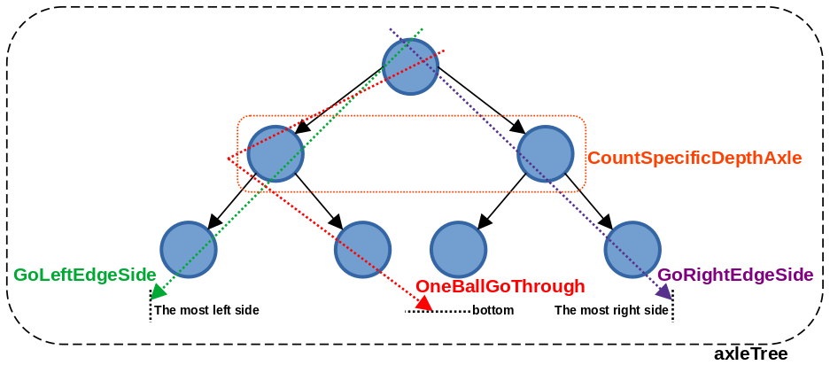
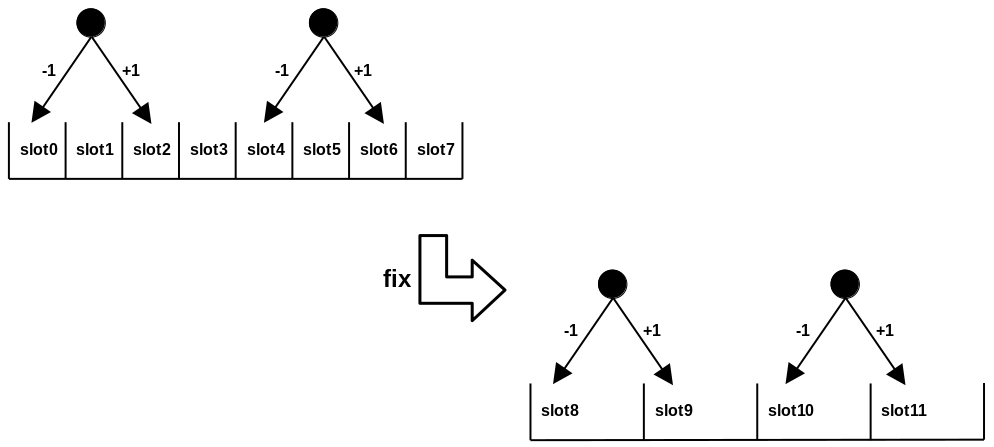
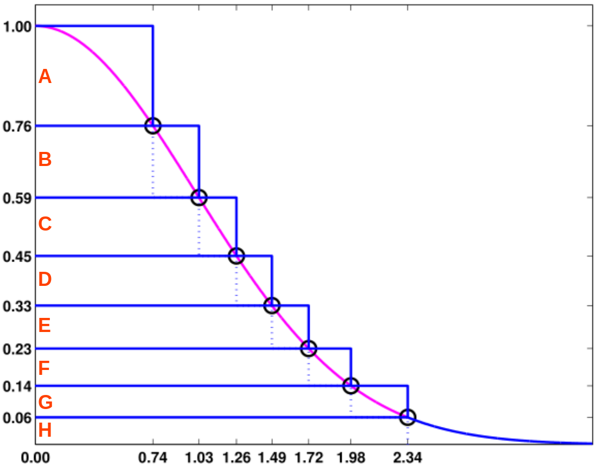
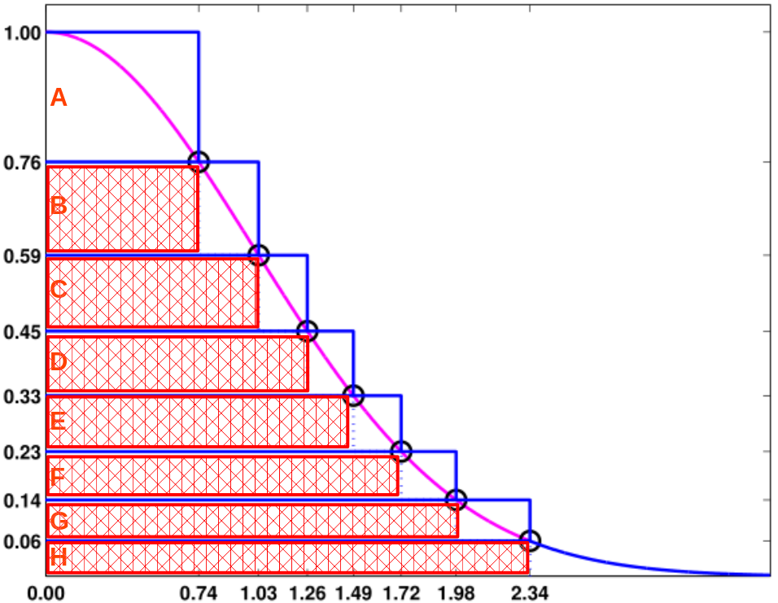
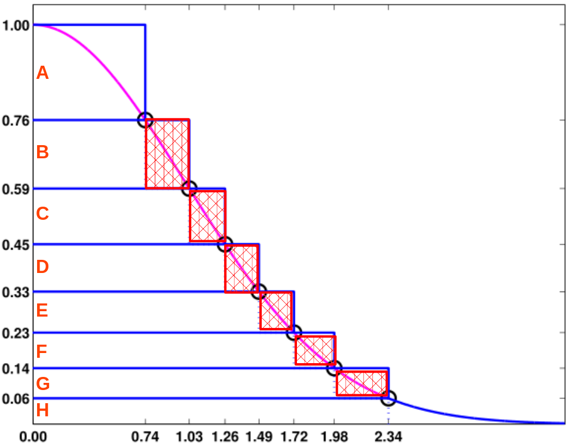
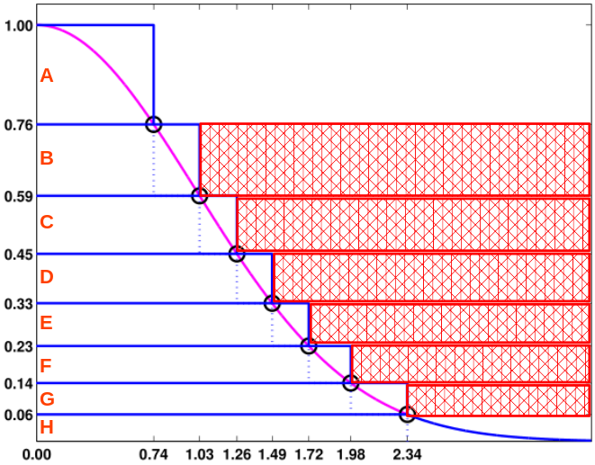
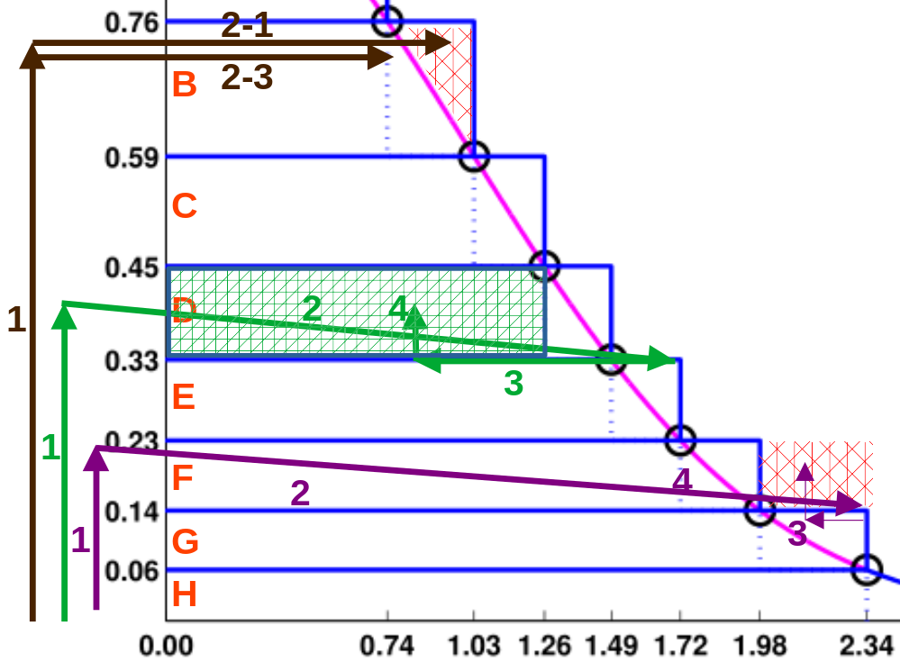
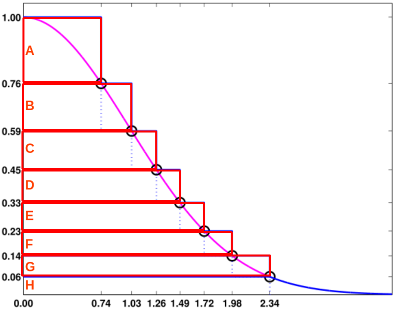
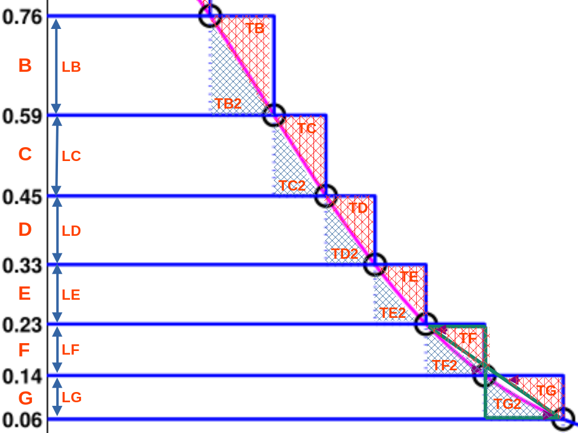
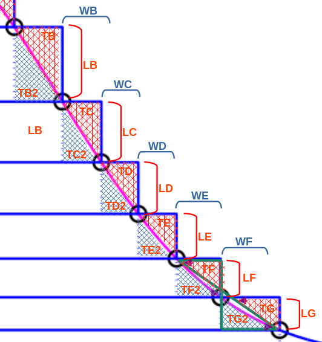

# 9.1 Normal Distribution

## Introduction

### Examples

#### Toss a coin

Toss a coin `ten times`, record  `the number of times it lands on heads` as `one set of tests`.

If you perform `multiple sets of tests`, the data will approach a `normal distribution`.

```bash
$ cd abstractionExplainedz/9statistics/9.1NormalDistribution/toss

$ make test
# go test -v -run='^\QTest_Check_' ./
# === RUN   Test_Check_Toss_And_Count
# === RUN   Test_Check_Toss_And_Count/TossTenTimes
# === RUN   Test_Check_Toss_And_Count/OneThousandCount
# --- PASS: Test_Check_Toss_And_Count (0.00s)
#     --- PASS: Test_Check_Toss_And_Count/TossTenTimes (0.00s)
#     --- PASS: Test_Check_Toss_And_Count/OneThousandCount (0.00s)
# PASS
# ok      github.com/panhongrainbow/abstractionExplainedz/9statistics/9.1NormalDistribution/toss
```

It seems that the simulation results conform to the normal distribution.

#### Pinball game

In `the ideal state`, when the marbles hit the axle, the chance to the left and right is `50%`, `1000 marbles` fall from the pinball game, will bear the result of `normal distribution`.

```bash
$ cd ./9statistics/9.1NormalDistribution/examples

$ head -n 13 pinball_test.go
```

```golang
package examples

import (
        "fmt"
        "github.com/stretchr/testify/require"
        "testing"
)

func Test_Check_pinball(t *testing.T) {
        // Creates a root axle node
        root := axle{}
        root.axleTree(0, 6, false) // <----- ----- ----- isRealWorld is false
```

```bash
$ go test -v -run='^\QTest_Check_pinball' ./

# The root and bottom nodes's layer are 0 !

# |_____|_____|_____|_____|_____Layer: 5, Left: 0.500000, Right: 0.500000
# |_____|_____|_____|_____|_____|_____Layer: 6, Left: 0.500000, Right: 0.500000
# |_____|_____|_____|_____|_____|_____|_____Layer: 0, Left: 0.500000, Right: 0.500000
# |_____|_____|_____|_____|_____|_____|_____Layer: 0, Left: 0.500000, Right: 0.500000
# |_____|_____|_____|_____|_____|_____Layer: 6, Left: 0.500000, Right: 0.500000
# |_____|_____|_____|_____|_____|_____|_____Layer: 0, Left: 0.500000, Right: 0.500000
# |_____|_____|_____|_____|_____|_____|_____Layer: 0, Left: 0.500000, Right: 0.500000
# |_____|_____|_____|_____|_____Layer: 5, Left: 0.500000, Right: 0.500000
# |_____|_____|_____|_____|_____|_____Layer: 6, Left: 0.500000, Right: 0.500000
# |_____|_____|_____|_____|_____|_____|_____Layer: 0, Left: 0.500000, Right: 0.500000
# |_____|_____|_____|_____|_____|_____|_____Layer: 0, Left: 0.500000, Right: 0.500000
# |_____|_____|_____|_____|_____|_____Layer: 6, Left: 0.500000, Right: 0.500000
# |_____|_____|_____|_____|_____|_____|_____Layer: 0, Left: 0.500000, Right: 0.500000
# |_____|_____|_____|_____|_____|_____|_____Layer: 0, Left: 0.500000, Right: 0.500000
# distribution:
# [3 0 27 0 124 0 206 0 313 0 192 0 108 0 24 0 3] <----- ----- ----- normal distribution !
# --- PASS: Test_Check_pinball (0.09s)
# PASS
```

In `the real world`, when the ball hits the axle, the chance of falling to the left or to the right is not 50%, but a `random value`.

However, `if multiple layers are stacked up`, when 1000 balls fall, the result is still `normal distribution`.

The critical point is that `the number of layers should be be sufficient`, enough to make `normal distribution`.

```bash
$ cd ./9statistics/9.1NormalDistribution/examples

$ head -n 13 pinball_test.go
```

```golang
package examples

import (
        "fmt"
        "github.com/stretchr/testify/require"
        "testing"
)

func Test_Check_pinball(t *testing.T) {
        // Creates a root axle node
        root := axle{}
        root.axleTree(0, 6, true) // <----- ----- ----- isRealWorld is true
```

```bash
$ go test -v -run='^\QTest_Check_pinball' ./

# The root and bottom nodes's layer are 0 !

# |_____|_____|_____|_____|_____|_____|_____|_____|_____Layer: 9, Left: 0.156067, Right: 0.843933
# |_____|_____|_____|_____|_____|_____|_____|_____|_____|_____Layer: 10, Left: 0.058596, Right: 0.941404
# |_____|_____|_____|_____|_____|_____|_____|_____|_____|_____|_____Layer: 0, Left: 0.120780, Right: 0.879220
# |_____|_____|_____|_____|_____|_____|_____|_____|_____|_____|_____Layer: 0, Left: 0.367506, Right: 0.632494
# |_____|_____|_____|_____|_____|_____|_____|_____|_____|_____Layer: 10, Left: 0.005692, Right: 0.994308
# |_____|_____|_____|_____|_____|_____|_____|_____|_____|_____|_____Layer: 0, Left: 0.757337, Right: 0.242663
# |_____|_____|_____|_____|_____|_____|_____|_____|_____|_____|_____Layer: 0, Left: 0.293966, Right: 0.706034
# |_____|_____|_____|_____|_____|_____|_____|_____|_____Layer: 9, Left: 0.265216, Right: 0.734784
# |_____|_____|_____|_____|_____|_____|_____|_____|_____|_____Layer: 10, Left: 0.421836, Right: 0.578164
# |_____|_____|_____|_____|_____|_____|_____|_____|_____|_____|_____Layer: 0, Left: 0.657448, Right: 0.342552
# |_____|_____|_____|_____|_____|_____|_____|_____|_____|_____|_____Layer: 0, Left: 0.434703, Right: 0.565297
# |_____|_____|_____|_____|_____|_____|_____|_____|_____|_____Layer: 10, Left: 0.592618, Right: 0.407382
# |_____|_____|_____|_____|_____|_____|_____|_____|_____|_____|_____Layer: 0, Left: 0.400969, Right: 0.599031
# |_____|_____|_____|_____|_____|_____|_____|_____|_____|_____|_____Layer: 0, Left: 0.362828, Right: 0.637172
# distribution:
# [0 0 1 0 7 0 73 0 141 0 152 0 242 0 226 0 132 0 21 0 4 0 1 0 0] <--normal distribution !
# --- PASS: Test_Check_pinball (0.17s)
# PASS
```

pinball functions



| function               | description                                                  |
| ---------------------- | ------------------------------------------------------------ |
| axleTree               | *axleTree* constructs *axle* tree by calling *makeNextBothNode* and itself recursively. |
| CountSpecificDepthAxle | *CountSpecificDepthAxle* counts the number of axles at the specific depth. |
| GoRightEdgeSide        | *GoRightEdgeSide* directs the pinball to the farthest right edge until reaching a null axle. |
| GoToTheLeftEdge        | *GoToTheLeftEdge* directs the pinball to the farthest left edge until reaching a null axle. |
| OneBallGoThrough       | *OneBallGoThrough* simulates the ball falling layer by layer until reaching the bottom. |

Why is the result of distribution  is [3 0 27 0 124 0 206 0 313 0 192 0 108 0 24 0 3] ?

It is `not a series of integers greater than 0`

 

- This is because each ball has only 2 ways, `add 1 to the right` and `subtract 1 to the left`.
- If there are two balls, `one to the left and one to the right`, `the difference` between the two balls will be `2`, and `the difference between the slots` for each ball falling `will always be 2`.

`The solution is to combine slots.`

For Example,

combine nest 0 and nest 1 to nest 8.

combine nest 2 and nest 3 to nest 9.

...

(一加一减，每个球落下的巢位永远差距为2，我有什么辨法，要解决这个问题，就是巢位合拼，就这样)

## Ziggurat algorithm

### The original image

`The pyramid algorithm` is used to generate `random normal distributions`.

The following is the original image.

 

### Three regions

The data above is divided into three regions:

`(1) acceptance region, (2) hesitation region, and (3) rejection region.`

|  regions   |                      region occupation                       |
| :--------: | :----------------------------------------------------------: |
| acceptance |  |
| hesitation |  |
| rejection  |  |

### Operation

There are three sample routes below, namely  `the purple line, the green line, and the brown line`.

- The sample from the `purple` line will be `rejected`.
- The sample from the `green` line will be `accepted`.
- The sample from the `brown` line will be `considered`.

 

Purple Line

| Purple ID | Operation Description                                        |
| :-------: | :----------------------------------------------------------- |
|     1     | Generate `a random number of 0.2` within the range of channels 0.14 to 0.23<br />and `enter channel F`. |
|     2     | At the `lower edge of channel F`, obtain `the value 2.34`.   |
|     3     | Generate `a random number of 0.9` in the range of 0 to 1,<br />multiply it by `the previous value of 2.34`. <br />`0.9 * 2.34 = 2.1` |
|     4     | Since 2.1 falls within the rejection range of 1.98 to 2.34, this sampling is `rejected`. |

Green Line

| Green ID | Operation Description                                        |
| :------: | :----------------------------------------------------------- |
|    1     | Generate `a random number of 0.4` within the range of channels 0.33 to 0.45<br />and `enter channel D`. |
|    2     | At the `lower edge of channel D`, obtain `the value 1.72`.   |
|    3     | Generate `a random number of 0.49418` in the range of 0 to 1,<br />multiply it by `the previous value of 1.72`. <br />`0.49418 * 1.72 = 0.85` |
|    4     | Since 0.85 falls within the acception range of 0 to 1.26, this sampling is `accepted`. |

Brown Line

| Brown ID | Operation Description                                        |
| :------: | :----------------------------------------------------------- |
|    1     | Generate `a random number of 0.74` within the range of channels 0.59 to 0.76<br />and `enter channel B`. |
|    2     | At the `lower edge of channel B`, obtain `the value 1.26`.   |
|   2-1    | Generate `a random number, 0.75`, within the range of 0 to 1, and multiply it by `the previous value, 1.26`.<br />`0.75 * 1.26 = 0.945`.<br />The coordinates `(0.945, 0.74)` fall within `the rejection region of the hesitation zone`, so we `reject` this sampling. |
|   2-2    | Generate `a random number, 0.6`, within the range of 0 to 1, and multiply it by `the previous value,1.26`.<br />`0.6 * 1.26 = 0.756`.<br />The coordinates `(0.756, 0.74)` fall within `the acceptance region of the hesitation zone`, so we `accept` this sampling. |

### Area Calculation

There is a key point, which is that `the area of all acceptance regions should be the same`.

Let's calculate it first.

(就是、就是下面红色所圈出的 A、B、C 至 G 的各个区域面积都要相同)

 

| Block Numbers | Length of each numbered block | Width of each numbered block | Area of each numbered block |
| :-----------: | :---------------------------: | :--------------------------: | :-------------------------: |
|       A       |             0.74              |         1-0.76=0.24          |      0.74*0.24=0.1776       |
|       B       |             1.03              |        0.76-0.59=0.17        |      1.03*0.17=0.1751       |
|       C       |             1.26              |        0.59-0.45=0.14        |      1.26*0.14=0.1764       |
|       D       |             1.49              |        0.45-0.33=0.12        |      1.49*0.12=0.1788       |
|       E       |             1.72              |        0.33-0.23=0.1         |       1.72*0.1=0.172        |
|       F       |             1.98              |        0.23-0.14=0.09        |      1.98*0.09=0.1782       |
|       G       |             2.34              |        0.14-0.06=0.08        |      2.34*0.08=0.1872       |


### Density Control

- It can be observed that the areas are approximately around 0.17.
  So why do we want to divide the areas to be roughly the same?
  I believe it is to control the density. (我认为是控制密度)

- As shown in the diagram below, `the triangles F, G, F2, and G2` are mostly similar, differing only in `scale`.

- From the length `LB to LG`, the triangles `TB2 to TG2` become progressively `smaller`. (相似三角形愈来愈小)

  As the triangles become smaller, the triangles assigned to `the hesitation or rejection zones` also become `smaller`.

  From the diagram below, it can be seen that the `lengths from LB to LF` are becoming `shorter`, and `the widths from WB to WF` are also becoming `shorter`.

  `The rejection regions` of each channel, which are composed of `length and width`, will also become `smaller`.

  For example, `the rejection region area of WF multiplied by LF` is `smaller` than `WB multiplied by LB`.

  (WF 乘上 LF 的拒绝区 面积 比 WB 乘上 LB 的小)

  
  (每一个通道由 A到G，所被分配的犹豫区和拒绝区只会愈来愈小) 

When generating a random number, the point falls into one of the intervals LB to LG.

`LB` has `the highest probability` of being selected because it has the longest length, while `LG` has `a smaller probability`.

- When falling into LB, it enters the B channel, `attracting more points`. However, `the hesitation and rejection zones are larger`, leading to the rejection of more points.
- When falling into LG, it enters the G channel, `attracting fewer points`. However, `the hesitation and rejection zones are smaller`, resulting in the rejection of fewer points.

From the above, it can be inferred that `when more points enter, more rejections occur`, and `when fewer points enter, fewer rejections occur`.

This balance `maintains a certain density`, hence the need to `maintain a specific density`.

(当进入点较多时，拒绝的次数也较多。当进入点较少时，拒绝的次数也较少。这样才能保持平衡，所以才说要保持一定的密度。)

### Acceptance Rate

The main focus here is to calculate the efficiency of this algorithm, and `a higher acceptance rate is better`.


The calculation formula is as follows:

Acceptance rate
= `(Length of acceptance region + Half of the length of hesitation region) / (Total length)`
= (Length of acceptance region + Half of the length of hesitation region) / (Length of acceptance region + Length of hesitation region + Length of rejection region)


|            Block numbers            | Acceptance region length | Hesitation region length | Rejection region length | Sampling acceptance rate calculation |
| :---------------------------------: | :----------------------: | :----------------------: | :---------------------: | :----------------------------------: |
| A<br />(estimated half of the area) |                          |                          |                         |                 50%                  |
|                  B                  |           0.74           |      1.03-0.74=0.29      |     1.26-1.03=0.23      |        (0.74+0.29/2)/1.26=70%        |
|                  C                  |           1.03           |      1.26-1.03=0.23      |     1.49-1.26=0.23      |       (1.03+0.23/2)/1.49=76.8%       |
|                  D                  |           1.26           |      1.49-1.26=0.23      |     1.72-1.49=0.23      |       (1.26+023/2)/1.72=79.9%        |
|                  E                  |           1.49           |      1.72-1.49=0.23      |     1.98-1.72=0.26      |       (1.49+0.23/2)/1.98=81.1%       |
|                  F                  |           1.72           |      1.98-1.72=0.26      |     2.34-1.98=0.36      |      (1.72+0.26/2)/2.34=`79.1%`      |
|                  G                  |           1.98           |                          |                         |                                      |

Previously, it was mentioned that the blocks range from A to G, and the acceptance rate should increase.

However, `why does the acceptance rate of F decrease?`

It is because there are not enough subdivisions with the same area. `The blocks are not divided enough`.

Finally, estimate the performance of the algorithm.

| Block numbers |    Width ratio    | Sampling acceptance<br />rate calculation | Width ratio times<br />Sampling acceptance rate |
| :-----------: | :---------------: | :---------------------------------------: | :---------------------------------------------: |
|       A       |  (1-0.76)/1=24%   |                    50%                    |                   24%*50%=12%                   |
|       B       | (0.76-0.59)/1=17% |                    70%                    |                  17%*70%=11.9%                  |
|      C~G      |  (1-24%-17%)=59%  |                    80%                    |                  59%*80%=47.2%                  |
|               |                   |                   `SUM`                   |             12%+11.9%+47.2%=`71.1%`             |

The performance of this algorithm is approximately `71.1%`.


