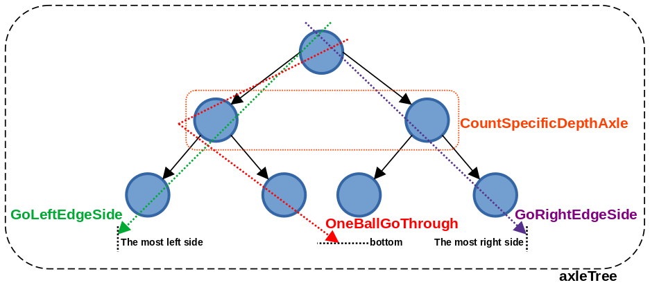
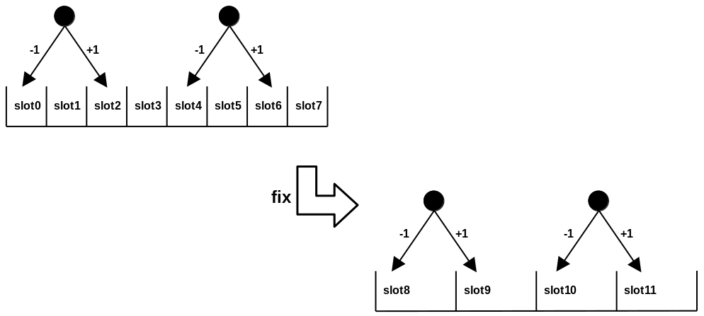

# 9.1 Normal Distribution

## Introduction

### Examples

#### Toss a coin

Toss a coin `ten times`, record  `the number of times it lands on heads` as `one set of tests`.

If you perform `multiple sets of tests`, the data will approach a `normal distribution`.

```bash
$ cd abstractionExplainedz/9statistics/9.1NormalDistribution/toss

$ make test
# go test -v -run='^\QTest_Check_' ./
# === RUN   Test_Check_Toss_And_Count
# === RUN   Test_Check_Toss_And_Count/TossTenTimes
# === RUN   Test_Check_Toss_And_Count/OneThousandCount
# --- PASS: Test_Check_Toss_And_Count (0.00s)
#     --- PASS: Test_Check_Toss_And_Count/TossTenTimes (0.00s)
#     --- PASS: Test_Check_Toss_And_Count/OneThousandCount (0.00s)
# PASS
# ok      github.com/panhongrainbow/abstractionExplainedz/9statistics/9.1NormalDistribution/toss
```

It seems that the simulation results conform to the normal distribution.

#### Pinball game

In `the ideal state`, when the marbles hit the axle, the chance to the left and right is `50%`, `1000 marbles` fall from the pinball game, will bear the result of `normal distribution`.

```bash
$ cd ./9statistics/9.1NormalDistribution/examples

$ head -n 13 pinball_test.go
```

```golang
package examples

import (
        "fmt"
        "github.com/stretchr/testify/require"
        "testing"
)

func Test_Check_pinball(t *testing.T) {
        // Creates a root axle node
        root := axle{}
        root.axleTree(0, 6, false) // <----- ----- ----- isRealWorld is false
```

```bash
$ go test -v -run='^\QTest_Check_pinball' ./

# The root and bottom nodes's layer are 0 !

# |_____|_____|_____|_____|_____Layer: 5, Left: 0.500000, Right: 0.500000
# |_____|_____|_____|_____|_____|_____Layer: 6, Left: 0.500000, Right: 0.500000
# |_____|_____|_____|_____|_____|_____|_____Layer: 0, Left: 0.500000, Right: 0.500000
# |_____|_____|_____|_____|_____|_____|_____Layer: 0, Left: 0.500000, Right: 0.500000
# |_____|_____|_____|_____|_____|_____Layer: 6, Left: 0.500000, Right: 0.500000
# |_____|_____|_____|_____|_____|_____|_____Layer: 0, Left: 0.500000, Right: 0.500000
# |_____|_____|_____|_____|_____|_____|_____Layer: 0, Left: 0.500000, Right: 0.500000
# |_____|_____|_____|_____|_____Layer: 5, Left: 0.500000, Right: 0.500000
# |_____|_____|_____|_____|_____|_____Layer: 6, Left: 0.500000, Right: 0.500000
# |_____|_____|_____|_____|_____|_____|_____Layer: 0, Left: 0.500000, Right: 0.500000
# |_____|_____|_____|_____|_____|_____|_____Layer: 0, Left: 0.500000, Right: 0.500000
# |_____|_____|_____|_____|_____|_____Layer: 6, Left: 0.500000, Right: 0.500000
# |_____|_____|_____|_____|_____|_____|_____Layer: 0, Left: 0.500000, Right: 0.500000
# |_____|_____|_____|_____|_____|_____|_____Layer: 0, Left: 0.500000, Right: 0.500000
# distribution:
# [3 0 27 0 124 0 206 0 313 0 192 0 108 0 24 0 3] <----- ----- ----- normal distribution !
# --- PASS: Test_Check_pinball (0.09s)
# PASS
```

In `the real world`, when the ball hits the axle, the chance of falling to the left or to the right is not 50%, but a `random value`.

However, `if multiple layers are stacked up`, when 1000 balls fall, the result is still `normal distribution`.

The critical point is that `the number of layers should be be sufficient`, enough to make `normal distribution`.

```bash
$ cd ./9statistics/9.1NormalDistribution/examples

$ head -n 13 pinball_test.go
```

```golang
package examples

import (
        "fmt"
        "github.com/stretchr/testify/require"
        "testing"
)

func Test_Check_pinball(t *testing.T) {
        // Creates a root axle node
        root := axle{}
        root.axleTree(0, 6, true) // <----- ----- ----- isRealWorld is true
```

```bash
$ go test -v -run='^\QTest_Check_pinball' ./

# The root and bottom nodes's layer are 0 !

# |_____|_____|_____|_____|_____|_____|_____|_____|_____Layer: 9, Left: 0.156067, Right: 0.843933
# |_____|_____|_____|_____|_____|_____|_____|_____|_____|_____Layer: 10, Left: 0.058596, Right: 0.941404
# |_____|_____|_____|_____|_____|_____|_____|_____|_____|_____|_____Layer: 0, Left: 0.120780, Right: 0.879220
# |_____|_____|_____|_____|_____|_____|_____|_____|_____|_____|_____Layer: 0, Left: 0.367506, Right: 0.632494
# |_____|_____|_____|_____|_____|_____|_____|_____|_____|_____Layer: 10, Left: 0.005692, Right: 0.994308
# |_____|_____|_____|_____|_____|_____|_____|_____|_____|_____|_____Layer: 0, Left: 0.757337, Right: 0.242663
# |_____|_____|_____|_____|_____|_____|_____|_____|_____|_____|_____Layer: 0, Left: 0.293966, Right: 0.706034
# |_____|_____|_____|_____|_____|_____|_____|_____|_____Layer: 9, Left: 0.265216, Right: 0.734784
# |_____|_____|_____|_____|_____|_____|_____|_____|_____|_____Layer: 10, Left: 0.421836, Right: 0.578164
# |_____|_____|_____|_____|_____|_____|_____|_____|_____|_____|_____Layer: 0, Left: 0.657448, Right: 0.342552
# |_____|_____|_____|_____|_____|_____|_____|_____|_____|_____|_____Layer: 0, Left: 0.434703, Right: 0.565297
# |_____|_____|_____|_____|_____|_____|_____|_____|_____|_____Layer: 10, Left: 0.592618, Right: 0.407382
# |_____|_____|_____|_____|_____|_____|_____|_____|_____|_____|_____Layer: 0, Left: 0.400969, Right: 0.599031
# |_____|_____|_____|_____|_____|_____|_____|_____|_____|_____|_____Layer: 0, Left: 0.362828, Right: 0.637172
# distribution:
# [0 0 1 0 7 0 73 0 141 0 152 0 242 0 226 0 132 0 21 0 4 0 1 0 0] <--normal distribution !
# --- PASS: Test_Check_pinball (0.17s)
# PASS
```

pinball functions



| function               | description                                                  |
| ---------------------- | ------------------------------------------------------------ |
| axleTree               | *axleTree* constructs *axle* tree by calling *makeNextBothNode* and itself recursively. |
| CountSpecificDepthAxle | *CountSpecificDepthAxle* counts the number of axles at the specific depth. |
| GoRightEdgeSide        | *GoRightEdgeSide* directs the pinball to the farthest right edge until reaching a null axle. |
| GoToTheLeftEdge        | *GoToTheLeftEdge* directs the pinball to the farthest left edge until reaching a null axle. |
| OneBallGoThrough       | *OneBallGoThrough* simulates the ball falling layer by layer until reaching the bottom. |

Why is the result of distribution  is [3 0 27 0 124 0 206 0 313 0 192 0 108 0 24 0 3] ?

It is `not a series of integers greater than 0`

 

- This is because each ball has only 2 ways, `add 1 to the right` and `subtract 1 to the left`.
- If there are two balls, `one to the left and one to the right`, `the difference` between the two balls will be `2`, and `the difference between the slots` for each ball falling `will always be 2`.

`The solution is to combine slots.`

For Example,

combine nest 0 and nest 1 to nest 8.

combine nest 2 and nest 3 to nest 9.

...

(一加一减，每个球落下的巢位永远差距为2，我有什么辨法，要解决这个问题，就是巢位合拼，就这样)
